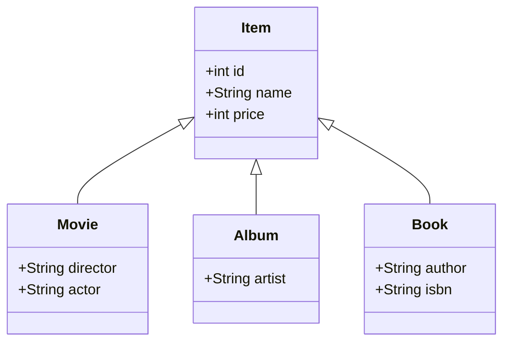
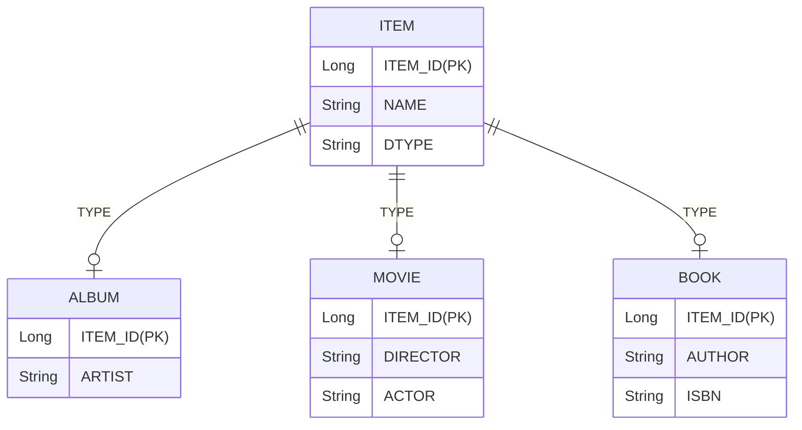

# 1장 JPA 소개 
## 1.1 SQL을 직접 다룰 때 발생하는 문제점 
- 관계형 데이터베이스 가장 대중적이고 신뢰할 수 있는 안전한 데이터 저장소이다.  
- Java로 개발하는 애플리케이션의 대부분 관계형 데이터 베이스를 사용한다. 
- 데이터베이스에 데이터를 관리하려면 SQL을 사용한다. 
- Java로 작성하는 애플리케이션은 JDBC API를 사용 해서 SQL을 데이터베이스에 전달한다. 
### 1.1.1  반복 반복 반복 ... 
    
```java
public class Member{
    private String memberId; 
    private String name; 
} 
```
```java  
public MemberDAO {
public Member find(String memberId){...}
public void save(Member member){...}
}
```
```java
String sql = "SELECT MEMBER_ID, NAME, FROM MEMBER M WHERE MEMBER_ID = ?" 
ResultSet rs = stmt.executeQuery(sql);
String memberId = rs.getString("MEMBER_ID"); 
String name = rs.getString("NAME"); 
Member member = new Member();
member.setMemberId(memberId); 
member.setName(name)
```
```java 
String sql = "INSERT INTO MEMBER(MEMBER_ID, NAME) VALUES(?, ?)";
pstmt.setString(1, member.getMemberId());
pstmt.setStrong(2, member.getName()); 
```
- 데이터베이스는 객체 구조와 다른 데이터 중심의 구조를 가지므로 데이터베이스에 직접 저장 조회가 불가능하기 때문에 개발자가 객체지향 애플리케이션과 데이터베이스 사이에서 JDBC API를 사용해서 변환하는  작업의 반복이 불가피하다.     
- 회원 객체를 데이터베이스가 아닌 자바 컬렉션에 저장을 한다면 아래와 같다. 
```java 
list.add(member)
```


### 1.1.2 SQL에 의존적인 개발 
```java
public class Member{
    private String memberId; 
    private String name; 
    private String tel; 
    private Team team; 
} 

public Class Team{
    ...
    private String teanName;
    ...
}
```
```java 

public MemberDAO {
    public Member find(String memberId){...}
    public void save(Member member){...}
    public Member findWithTeam(String memberId){...}
}
```

```java 
String sql = "INSERT INTO MEMBER(MEMBER_ID, NAME, TEL) VALUES(?, ?, ?)";
pstmt.setString(1, member.getMemberId());
pstmt.setStrong(2, member.getName()); 
pstmt.setString(3, member.getTel()); 
```
```java 
list.add(member)
Member member = list.get(xxx); 
member.setTel("xxx");
``` 
- 데이터 접근 계층을 사용해서 SQL을 숨겨도 어쩔 수 없이 DAO를 열어서 어떤 SQL이 실행되는지 확인해야 한다. 
- Member, Team 처럼 비즈니스 요구 사항을 모델링한 객체를 **Entity**라고 한다. 
- SQL에 모든 것을 의존하는 상황에서 Entity를 신뢰하고 사용할 수 없고 DAO를 열어서 어떤 SQL이 실행, 객체들이 조회되고 있는지 확인해야 한다. 
- SQL과 JDBC API를 데이터 접근 계층에 숨기는 것은 성공했지만 강한 의존관계를 가지고 있다. 
- 따라서 조회, 추가 시에 CRUD 코드와 SQL을 대부분 변경이 필요하다.  

### 1.1.3 JPA와 문제 해결
- JPA 저장 , 조회, 수정, 연관 객체 조회등을 지원한다.  

```java 
// 1. 객체를 데이터베이스에 저장
jpa.persist(member);  

// 2. 객체를 데이터베이스에서 조회  
String memberId = "studyId" 
jpa.find(Member.class, memberId) 

// 3.수정 
Member member = jpa.find(Member.class, memberId);
member.setName("이름변경") 

// 4.객체조회 
Member member = jpa.find(Member.class, memberId); 
Team team = member.getTeam(); 

```
## 1.2 패러다임 불일치  
- 애플리케이션 발전하면서 복잡도가 증가하고 이는 유지보수의 어려움으로 이러진다.    
- 객체 지향 프로그래밍은 추상화, 캡슐화, 은닉화, 상속, 다형성 등 시스템의 복잡성을 제어할 수 있는 다양한 장치를 제공하고 현대의 복잡한 애플리케이션은 대부분 객체지향 언어로 개발한다. 
- 비즈니스 요구사항을 정의한 도메인 모델도 객체로 모델링 하면 객체지향 언어가 가진 장점을 활용할 수 있다. 
- 문제는 정의한 도메인 모델을 저장할 때 발생한다. 
- 객체는 속성과 기능을 가진다. 객체의 기능을 클래스에 정의되어 있으므로 객체 인스턴스의 상태인 속성만 저장했다가 필요시 불러와서 복구하면 된다.
- 객체가 단순하면 파일이나 데이터베이스에 모든 값을 저장하면 되지만 상속, 참조의 경우 저장하기 쉽지 않다. 
- 객체와 관계형 데이터베이스는 지향하는 목적이 서로 다르므로 둘의 기능과 표현 방법도 다르다. 
### 1.2.1 상속 
    


```java
abstract class Item {
    Long id;
    String name; 
    int price; 
}
class Album extends Item {
    String director; 
    String actor;
}
class Book extends ITem {
    String author; 
    String isbn;
}
```
- Album 객체를 저장할려면 객체를 분해해서 두 개의 SQL을 만들어서 INSERT 해야 한다. 
- Album 객체를 조회하려면 ITEM, ALBUM 테이블을 조인해서 조회 후 Album객체를 생성해야 한다 
```java
list.add(album);
list.add(movie);
Album album = list.get(albumId); 
```
- JPA는 상속과 관련된 패러다임의 불일치 문제를 해결해준다. 
```java 
//저장 
jpa.persist(album); 
INSERT INTO ITEM ... 
INSERT INTO ALBUM ... 
//조회 
String albumId = "id00"; 
Album album = jpa.find(Album.class, albumId); 
```
### 1.2.2 연관관계 
- 객체는 **참조**를 사용해서 다른 객체와 연관관계를 가지고 참조에 접근해서 연관된 객체를 조회한다. 
- 테이블은 외래키를 사용해서 다른 테이블과 연관관계를 가지고 조인을 사용해서 연관된 테이블을 조회한다. 
- 참조를 사용하는 객체와 연관 관계를 사용하는 관계형 데이터베이스의 패러다임의 불일치  
```java 
class Member{
    Team team;

    Team getTeam(){
        return team; 
    }

}
member.getTeam(); 
```   
```sql 
SELECT M.*, T.* 
    FROM MEMBER M
    JOIN TEAM T ON M.TEAM_ID = T.TEAM_ID; 
```   
- 객체는 참ㅈ호가 있는 방향으로만 조회가 가능하다. 
- member.getTeam() 은 가능하지만 반대 방향 team.getMember() 는 불가능하다. 
- 테이블의 경우 외래키 하나로만 가능하다. 
```java 
// 1. 테이블에 맞춘 객체 모델 
class Member {
    String id; 
    Long teamId; 
    String userName; 

}
class Team {
    Long id; 
    String teamName; 

}
// 2. 참조를 사용하는 객체 모델  
class Member {
    String id; 
    Team team; 
    String userName; 

}
class Team {
    Long id; 
    String teamName; 

}
```
- 객체 모델은 외래키가 필요 없고, 테이블은 참조가 필요 없다. 개발자가 중간에 변환 역할을 해야한다. 
### 1.2.3 객체 그래프 탐색 
- 객체에서 회원이 소속된 팀을 조회할 때 참조를 사용해서 연관된 팀을 찾는데 이를 객체 그래프 탐색이라고 한다. 
- SQL을 직접 다루면 처음 실행하는 SQL에 따라서 객체 그래프를 어디까지 탐색할 수 있을지 정해진다. 
```java 
class MemberService {
    public void process () {

        Member member = memberDAO.find(memberId); 
        member.getTeam(); 
        member.getOrder(); 
    }
}
```
- MemberService 는 memberDAO를 통해서 member객체를 조회했지만 이 객체와 연관된 Team, Order, Delivery 방향으로 객체를 탐색여부는 위 코드 만으로는 알 수 없다. 
- DAO를 열어서 SQL을 직접 확인해야 한다. 
#### JPA와 객체 그래프 탐색 
- JPA를 사용하면 객체 그래프를 마음껏 탐색할 수 있다. 
- JPA는 연관된 객체를 사용하는 시점에 적절한 SELECT SQL을 실행한다. 
### 1.2.4 비교 
- 데이터베이스는 기본 키의 값으로 각 로우를 비교한다. 
- 객체는 동일성 비교와 동시성 비교라는 두가지 비교 방법이 있다. 
- 동일성 비교는 == 비교다. 객체 인스턴스의 주소 값을 비교한다. 
- 동등성 비교는 equals() 메소드를 사용해서 객체 내부의 값을 비교한다.     
### 1.2.5 정리 

## 1.3 JPA란 무엇인가? 
- JPA(Java PErsistence API)는 Java진영의 ORM 기술 표준이다. 
- ORM(Object Relational Mapping)
- ORM 프레임워크는 단순히 SQL을 개발자 대신 생성해서 데이터베이스에 전달 하는 것 뿐만 아니라 다양한 패러다임의 불일치 문제도 해결해 준다. 
### 1.3.1 JPA 소개 
### 1.3.2 왜 JPA를 사용해야 하는가 
#### 생산성 
- 지루하고 반복적인 코드 CRUC용 SQL을 개발자가 작성하지 않아도 된다. 
- 데이터 설계 중심의 패러다임을 객체 설계 중심으로 역전시킬 수 있다. 
#### 유지보수 
- SQL을 직접 다루면 엔티티에 필드를 하나만 추가 해도 JDBC API 코드를 모두 변경해야 하지만 JPA는 수정해야 할 코드가 줄어든다, 
#### 패러다임의 불일치 해결 
#### 성능 
- 다양한 성능 최적화 기회를 제공한다.  
- 데이터 접근 추상화와 벤더 독립성 
- JPA는 애플리케이션과 데이터베이스 사이에 추상화된  데이터 접근 계층을 제공해서 애플리케이션이 특정 데이터베이스에 종속되지 않도록 한다. 