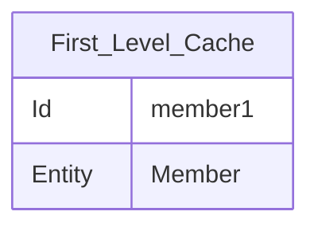
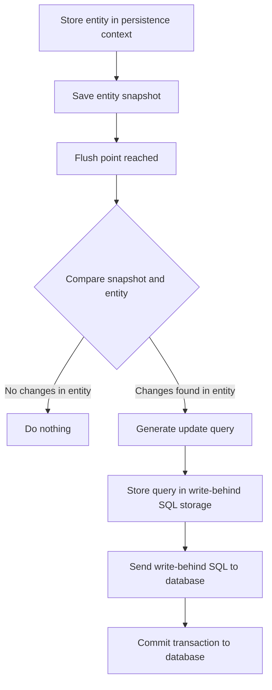

# 3장 영속성 관리  
- JPA가 제공하는 기능은 크게 엔티티와 테이블을 매핑하는 설계 부분과 엔티티를 실제로 사용 하는 부분으로 구분할 수 있다. 
- 엔티티 매니저는 엔티티를 저장, 수정, 삭제, 조회 등 엔티티와 관련된 모든 일을 처리한다.  

## 3.1 EntityManagerFactory 와 EntityManager 
- 데이터베이스를 하나만 사용하는 애플리케이션은 일반적은 EntityManagerFactory를 하나만 생성한다. 

```java
EntityManagerFactory emf = Persistence.createEntityManagerFactory("jpabook")

```
- META-INF/persistence.xm에 있는 정보를 바탕으로 EntityManagerFactory를 생성한다. 
```java
EntityManager em = emf.createEntityManager(); 
```
- 필요할 때 마다 EntityManagerFactory 에서 EntityManager를 생성하면 된다.
- EntityManagerFactory는 여러 스레스드가 동시에 접근해도 안전하므로 서로 다른 스레스에서 공유해도 되지만 엔티티 매니저는 여러 스레드가 동시에 접근하며 문제가 발생하므로 스레드 간에 절대 공유 해서는 안된다. 

- Hibernate를 포함한 JPA 구현체들은 EntityManager Factory 를 생성한다. ConnectionPool을 만드는데 이것은 J2SE 환경에서 사용하는 방법이다.  

## 3.2 영속성 컨텍스트 
- JPA를 이용하는데 가장 중요한 용어는 영속성 컨텍스트(persistence context)이다. 엔티티를 영구 저장하는 환경이라는 의미이다. 
- 엔티티 매니저로 엔티티를 저장하거나 조회하면 엔티티 매니저는 영속성 컨텍스트에 엔티티를 보관하고 저장한다. 
```java 
em.persist(member)
```
- persist()메소드는 엔티티 매니저를 사용해서 회원 엔티티를 영속성 컨테슥트에 저장한다. 
- 영속성 컨텍스트는 논리적인 개념이다. 영속성 컨텍스트는 앤티티 매니저를 생성할 때 하나 만들어진다. 
- 엔티티 매니저를 사용해서 영속성 컨텍스트에 접근할 수 있고 영속성 컨텍스트를 관리할 수도 있다. 

## 3.3 엔티티 생명주기 

#### 비영속(new/transient) 
- 영속성 컨텍스트와 전혀 관계없는 상태 
```java
Member member = new Member(); 
member.setId("member1");
member.setUserName("회원1");
```  
- Entity 객체를 생성하고 순수한 객체 상태로 아직 저장하지 않았다. 
- 영속성 컨텍스트 및 데이터베이스와는 전혀 관련이 없다. 

#### 영속 (manged) 
- 영속성 컨텍스트에 저장된 상태 
- EntityManager를 통해서 영속성 컨텍스트에 저장했다. 
- 영속성 켄텍스트가 관리하는 엔티티를 영속 상태라고 한다. 
```java
em.persist(member);
```

#### 준영속 (detached)
-  영속성 컨텍스트에 저장되었다가 분리된 상태 
- 영속성 컨텍스트가 관리하던 영속 상태의 Entity를 영속성 컨텍스트가 관리하지 않으면 준영속 상태가 된다. 
- 특정 Entity를 준영속 상태로 만들려면 em.detach()를 호출하면 된다. 
- em.clear()를 통해서 영속성 컨텍스트를 초기화 또는 em.close()를 영속성 컨텍스트를 닫으면 영속성 컨텍스트가 관리하면 영속 상태의 Entity가 준영속 상태가 된다. 
```java 
em.detach(member); 
```

#### 삭제 (removed)
- Entity를 영속성 컨텍스트와 데이터베이스에서 삭제한다. 
```java
em.remove(member);
```
## 3.4 영속성 컨텍스트의 특징 
#### 영속성 컨텍스트와 식별자 값 
- 영속성 컨텍스트는 Entity를 식별자 값**(@Id로 테이블의 기본키와 매핑한 값)**으로 구분한다.
- 따라서 영속상태에는 **식별자 값**이 반드시 있어야 한다.

#### 영속성 컨텍스트와 데이터베이스 저장 
- JPA는 보통 트랜잭션을 커밋하는 순간 영속성 컨텍스트에 새로 저장된 Entity를 데이터 베이스에 반영하는데 이것을 Flush라고 한다. 

#### 영속성 컨텍스트가 Entity를 관리하면 장점 
    1. 1차 캐시 
    2. 동일성 보장 
    3. 트랜잭션에 지원하는 쓰기 지원
    4. 변경 감지 
    5. 지연 로딩 

### 3.4.1 엔티티 조회 
- 영속성 컨텍스트는 내부에 캐시를 가지고 있는데 이것을 1차 캐시라고 한다. 
- 영속 상태의 Entity는 모두 이곳에 저장된다. 
- 영속성 컨텍스트 내부에 Map이 하나 있는데 키는 @Id로 매핑한 식별자이고 값은 엔티티 인스턴스이다.  
```Java
Member member = new Member();
member.setId("member1"); 
member.setUserName("회원1");
em.persist(member); 
```

- 1차 캐시의 키는 식별자의 값이다. 식별자의 값은 데이터베이스 기본 키Primary Key)와 매핑이 되어있다. 
- 영속성 컨텍스트에 데이터를 저장하고 조회하는 모든 기준은 데이터베이스 기본 키 값이다. 
```java 
Member member = em.find(Member.class, "member1"); 
public<T> find(Class<T> entityClass, Object primaryKey); 
``` 
- em.find()를 호출하면 1차 캐시에서 엔티티를 찾고 없으면 데이터베이스에서 조회한다. 
#### 1차 캐시에서 조회 
```java 
Member member = new Member(); 
member.setId("member1"); 
member.setUserName("회원1"); 

em.persist(member); 
Member findMember = em.find(Member.class, "member1"); 
```
#### 데이터베이스에서 조회
- em.find()를 호출했는데 엔티티가 1차 캐시에 없으면 엔티티 매니저는 데이터베이스를 조회해서 엔티티를 생성한다. 
- 1차 캐시에 저장 후 영속 상태의 엔티티를 반환한다. 
#### 영속 엔티티의 동일성 보장 
```java 
Member a = em.find(Member.class, "member1"); 
Member b = em.find(Member.class, "member2");
```
- em.find(Member.class, "member1")을 반복해서 호출해도 영속성 컨텍스트는 1차 캐시에 있는 같은 엔티티의 인스턴스를 반환한다. 
        
### 3.4.2 엔티티 등록 
- 엔티티 매니저는 트랜잭션을 커밋하기 직전까지 데이터베이스에 엔티티를 저장하지 않는다. 
- 내부 쿼리 저장소에 INSERT SQL을 모아둔다. 
- 트랜잭션을 커밋할 때 모아둔 쿼리를 데이터베이스에 보내는데 이것을 트랜잭션을 지원하는 **쓰기 지연(transactional write-behind)**이라고 한다. 
```java 
EntityManager em = emf.createEntityManager(); 
EntityTransaction transaction = em.getTransaction(); 
transaction.begin(); 

em.persist(memberA);
em.persist(memberB); 

transaction.commit(); 
```
- 트랜잭션을 커밋하면 엔티티매니저는 영속성 컨텍스트를 플러시 한다. 
- 플러시는 영속성 컨텍스트의 변경 내용을 데이터베이스에 동기화 하는 작업으로 이때 등록, 수정, 삭제한 엔티티를 데이터베이스에 반영한다. 

### 3.4.3 엔티티 수정
#### SQL 수정 쿼리의 문제점 
- SQL을 사용하면 수정 쿼리를 직접 작성해야 한다. 
- 수정 쿼리를 추가 하는 개발 방식의 문제점은 수정 쿼리가 많아지는 동시에 비즈니스 로직을 분석하기 위해 SQL을 계속 확인해야 하며, 비즈니스 로직이 SQL에 의존하게 된다. 
```Java
Member memberA = em.find(Member.class, "memberA"); 
memberA.setUserName("hi");
memberA.setAge(10); 
transaction.commit(); 
```
- JPA로 엔티티를 수정할 때는 단순히 엔티티를 조회해서 데이터만 변경하면 된다. 
- 엔티티의 데이터만 변경했는데 어떻게 데이터베이스에 반영이 되어있는 걸까? 
- 엔티티의 변경사항을 자동으로 반영하는 기능을 변경감지(Dirty Checking)라 한다. 

#### 변경 감지(Dirty Checking) 
- JPA 엔티티를 영속성 컨텍스트에 보관할 때 최초 상태를 복사해서 저장해 두는데 이것을 스냅샵이라고 한다. 
- 플러시 시점에 스냅샷과 엔티티를 비교해서 변경된 엔티티를 찾는다. 
- 트랜잭션을 커밋하면 엔티티 매니저 내부에서 먼저 플러시가 호출된다. 
- 엔티티와 스냅샷을 비교해서 변경된 엔티티를 찾는다. 
- 변경된 엔티티가 있으면 수정 쿼리를 생성해서 쓰기 지연 SQL 저장소에 보낸다. 
- 쓰기 지연 저장소의 SQL을 데이터베이스에 보낸다. 
- 데이터베이스에 트랜잭션을 커밋한다.

- 변경감지는 영속성 컨텍스트가 관리하는 영속 상태의 엔티티에만 적용이 된다. 
#### 변경감지와 Update SQL 
- 회원의 나이와 이름을 수정하면 아래의 수정 쿼리가 생성될 것으로 예상할 수 있다. 
    ```SQL 
    UPDATE MEMBER 
        SET NAME = ?, 
             AGE = ? 
        WHERE id = ?  
    ```
- 하지만 JPA의 기본 전략은 엔티티의 아래와 같이 모든 필드를 업데이트한다. 
    ```SQL 
    UPDATE MEMBER 
        SET NAME = ?, 
             AGE = ?, 
           GRADE = ? 
        WHERE id = ?  
    ```
- 위와 같이 모든 필드를 사용하면 데이터베이스에 보내는 데이터 전송량이 증가하는 단점이 있다. 
- 모든 필드를 사용하면 수정쿼리는 항상 같아. 따라서 애플리케이션 로딩 시점에 수정 쿼리를 미리 생성해 두고 재사용이 가능하다. 
- 데이터베이스에 동일한 쿼리를 보내년 데이터베이스는 이전에 한 번 파싱된 쿼리를 재사용할 수 있다. 
- 필드가 많거나 저장되는 내용이 너무 크면 수정된 데이터만 재사용해서 동적으로 UPDATE SQL을 생성하는 전략을 선택하면 된다. 
```java
@Entity 
@org.hibernate.annotations.DyamicUpdate
@Table(name="Member")
public class Member() {...}

``` 
### 3.4.4 엔티티 삭제 
- 엔티티를 삭제하려면 먼저 삭제대상 엔티티를 조회한다. 
```java 
Member memberA = em.find(Member.class, "memberA"); 
em.remove(memberA); 
```
- em.remove()에 삭제 대상 엔티티를 넘겨주면 엔티티를 삭제한다. 
- 즉시 삭제되는 것이 아리나 엔티티 등록과 비슷하게 삭제 쿼리를 쓰기 지연 SQL저장소에 등록한다. 
- 트랜잭션을 커밋해서 플러시를 호출하면 실제 데이터 베이스에 삭제쿼리를 전달한다. 
- **삭제된 엔티티는 재사용하지 말고 자연스럽게 가비지 컬렉션의 대상이 되도록 두는 것이 좋다** 

## 3.5 플러시 
- 플러시는 영속성 컨텍스트의 변경내용을 데이터 베이스에 반영한다. 
- 플러시를 실행하면 아래와 같은 일이 발생한다. 

        1. 변경 감지가 동작해서 영속성 컨텍스트에 있는 모든 엔티티를 스냅샷과 비교해서 수정된 
        2. 엔티티를 찾는다. 
        3. 수정된 엔티티는 수정 쿼리를 만들어 쓰기 지연 SQL저장소에 등록한다. 
- 영속성 컨텍스트를 플러시하는 방법1 - 직접 호출  
    - em.flush() 호출 
-  영속성 컨텍스트를 플러시하는 방법2 - 트랜잭션 커밋시 자동 반영
    - 트랜잭션을 커밋하기 전에 꼭 플러시를 호출해서 영속성 컨텍스트의 변경 내용을 데이터베이스에 반영해야 한다. 
    - JPA는 이런 문제를 예방하기 위해 트랜잭션을 커밋하기 전에 플러시를 자동으로 호출한다.  
- 영속성 컨텍스트를 플러시하는 방법2  - JPQL 쿼리 실행 
    - JPQL, Criteria 같은 객체지향 쿼리를 호출할 때에도 플러시가 실행된다. 
### 3.5.1 플러시 모드 옵션 
-  엔티티 매니저에 플러시 모드를 직접 지정하려면 javax.persistence.FlushModeType를 사용하면 된다. 
- FlushModeType.ATUTO : 커밋이나 쿼리를 실행할 때 플러시 
- FlushModeType.COMMIT : 커밋할 때만 플러시 

## 3.6 준영속 
- 영속성 컨텍스트가 관리하는 영속 상태의 엔티티가 영속성 컨텍스트에 분리된 것을 준영속 상태라고 한다. 
- 준영속 상태의 엔티티는 영속성 컨텍스트가 제공하는 기능을 사용할 수 없다. 
### 3.6.1 엔티티를 준영속 상태로 전환 : detach()
```java 
public void detach(Object entity){

}
public coid testDetached(){
    // 회원 엔티티를 생성 
    Member member = new Member(); 
    member.setId("memberA"); 
    member.setUserName("회원1"); 

    // 영속화 
    em.persist(member);
    // 준영속화 
    em.detacth(member); 
    transaction.commit();
}

```
- detach()를 호출하는 순간 1차 캐시 부터 쓰기 지연 SQL 저장소 까지 해당 엔티티를 관리하기 위한 모든 정보가 제거 된다. 
- 쓰기 지연 SQL저장소에의 INSERT SQL도 제거된다. 
### 3.6.3 영속성 컨텍스트 초기화 clear()
- em.detach()가 **특정 엔티티 하나를 준영속 상태**로 만들었다면 em.clear()는 영속성 컨텍스트 초기화 해서 해당 영속성 컨텍스트를 준영속 상태로 만든다. 

### 3.6.2 영속성 컨텍스트 종료: close() 
- 영속성 컨텍스트를 종료하면 해당 영속성 컨텍스트가 관리하던 영속 상태의 엔티티가 모두 준영속 상태가 된다. 
```java
public void cliseEntityManaget() {
    EntityManagerFactory emf = Persistence.createEntityManagerFactory("jpabook")

    EntityManager em = emf.createEntityManager(); 
    EntityTransaction tracsaction = em.getTransaction(); 

    transaction.begin(); 

    Member memberA = em.find(Member.class, "memberA")
    Member memberB = em.find(Member.class, "memberB")

    em.close(); 

}
```
### 3.6.4 준영속 상태의 특징 
- 영속성 컨텍스트가 관리하지 않으므로 1차 캐시, 쓰기 지연, 변경감지, 지연로딩등 영속성 컨텍스트가 제공하는 어떠한 기능도 작동하지 않기 때문에 거의 비영속 상태에 가깝다. 
- 비영속 상태는 값이 없을 수도 있지만 준영속 상태는 한번 영속 상태였으므로 반드시 식별자 값을 가지고 있다. 
- 지연 로딩은 실체 객체 대신 프록시 객체를 로딩해두고 해당 객체를 실제 사용할 때 영속성 컨텍스트를 통해 데이터를 불러오는 방법이다. 따라서 지연 로딩을 할 수없다. 
### 3.6.5. 병합: Merge() 
- 준영속 상태에서 다시 영속 상태로 변경하려면 병합을 사용하면 된다. 
- merge()는 준영속 상태의 엔티티를 받아서 그 정보로 새로운 영속 상태의 엔티티를 반환한다. 
```java 
public <T> T merge(T entity); 

public mergeMember = em.member(member);
```
#### 준영속 병합 
```java 
public class ExamMemgeMain{
    static EntityManagerFactory emf = Persistence.createEntityManagerFactory("jpabook");

    public static void main(String argsp[]){
        Member member = createMember("memberA" , "회원1");

        member.setUerName("회원명 변경")
        memgrMember(member); 
    }

    static Member createMember(String id, String userName){
        EntityManager em1 = emf.createManager(); 
        EntityTransaction tx1 = em1.getTransaction(); 
        tx1.begin(); 

        Member member = new Member(); 
        member.setId(id);
        member.setUserName(userName); 

        em1.persist(member); 
        tx1.commit();  

        em1.close(); 

        return member; 
    }

static void mergeMember(Member member){
        EntityManager em2 = emf.createEntityManager();
        EntityTransaction tx2 = em2.getTransaction();

        tx2.begin();
        //Member mergeMember = em2.merge(member);
        member = em2.merge(member)
        tx2.commit();
        
        //준영속 상태
        System.out.println("member =" + member.getUsername()) ;
        
        //영속 상태
        System.out.println("mergeMember =" + mergeMember.getUsername()) ;
        System.out.println("em2 contains2 member = " + em2.contains(member));
        System.out.println("em2 contains2 mergeMember = " + em2.contains(mergeMember));
        
        em2.close();
    }

}

```
#### 비영속 병합 
- 병합은 준영속과 비영속을 신경 쓰지 않는다. 식별자의 값으로 엔티티를 조회할 수 있으면 불러서 병합하고 없으면 새로 병합한다. 


