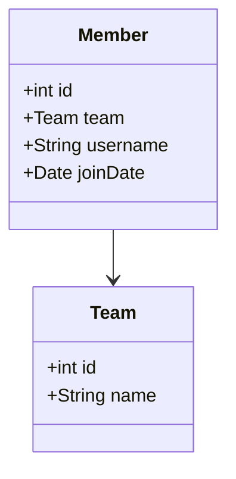
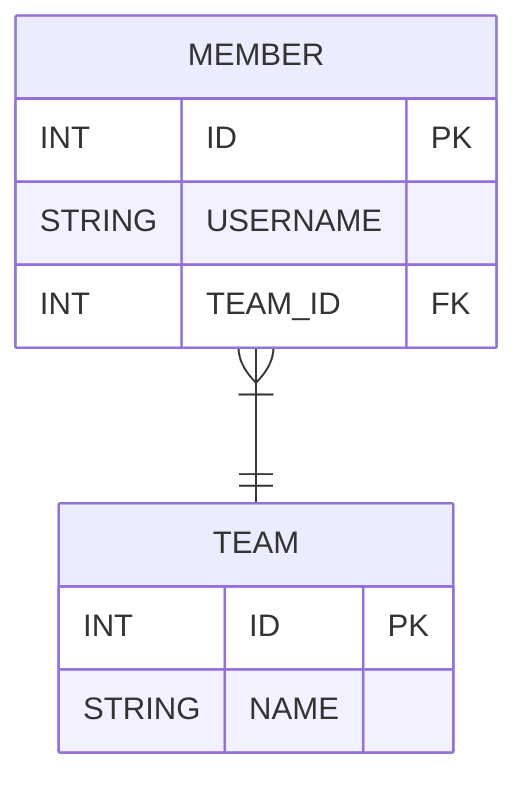

# 5장 연관관계 매핑 기초 
#### 방향(Direction) 
- 단방향과 양방향이 있다. 
- 회원과 팀이 관계가 있을 때  회원과 팀 둘중 한 쪽만 참조하는 것을 단방향 관계라고 하고 양쪽 모두 서로 모두 참조 하는 것을 양방향 연관 관계라고 한다. 
- 방향은 객체 관계에서만 존재하고 테이블 관계는 항상 양방향이다. 

#### 다중성 (Multipleity)
- 다대일 (N:1)
- 일대다 (1:N)
- 다대다 (N:M)
#### 연관관계의 주인 (owner)
- 객체를 양방향 연관 관계를 만들면 연관관계의 주인을 정해야 한다. 

## 5.1 단방향 연관관계 
        회원과 팀이 있다. 
        회원은 하나의 팀에만 소속될 수 있다. 
        회원과 팀은 다대일 관계이다. 


#### 객체 연관 관계 
- 회원 객체는 Member.team 필드로 팀 객체와 연관관계를 맺는다. 
- 회원 객체와 팀 객체는 단방향 연관관계다. 
- 회원은 Member.team 필드를 통해 팀을 알 수 있지만 팀을 회원을 알수 없다. 
#### 테이블 연관관계 
- 회원 테이블은 TEAM_ID 외래키로 팀 테이블관 연관관계를 맺는다. 
- 회원 테이블과 팀테이블은 양방향 연관관계이다. 
- 회원 테이블의 TEAM_ID 외래 키를 통해서 회원과 팀을 조인할 수도 있고 반대로 팀과 회원을 조인할 수 있다. 
```sql
SELECT *
  FROM MEMBER M
  JOIN TEMA T ON M.TEAM_ID = T.ID  

SELECT *
  FROM TEAM T 
  JOIN MEMBER M ON M.TEAM_ID = T.ID 
```
#### 객체 연관 관계와 테이블 연관 관계의 가장 큰 차이 
- 참조를 통한 연관관계는 언제나 단방향이다. 
- **객체간에 연관관계를 양방향으로 만들고 싶으면 반대쪽에도 필드를 추가해서 참조를 보관해야 한다.** 
- 결국 연관관계를 하나 더 만들어야 한다. 
- 양쪽에서 서로 참조하는 것을 양방향 연관관계라고 한다. 이것은 양방향 연관관계가 아니라 서로 다른 단방향 연관관계 2개이다. 
```java 
// 단방향 연관관계 
class A{
    B b; 
}
class B{

}
// 양방향 연관관계 
class A {
    B b; 
}
class B{
    A a; 
}
```
#### 객체 연관관계 vs 테이블 연관관계 정리 
- 객체는 참조(주소)로 연관관계를 맺는다. 
- 테이블은 외래 키로 연관관계를 맺는다.

### 5.1.1 순수한 객체 연관 관계 
```java 
public class Member {
    private String id; 
    private String username; 

    private Team team; 

    public void setTeam(Team team){
        this.team = team; 
    }

    // Getter, Setter 
}

public class Team{
    private String id; 
    private String name; 

    // Getter, Setter 
}

public static void main(String[] args) { 
    Member member1 = new Member("member1", "회원1");
    Member member2 = new Member("member2", "회원2");

    Team team = new Team("team1", "Team1"); 
    member1.setTeam(team);
    member2.setTeam(team);
    

    Team findTeam = member1.getTeam();
}
```
- 객체는 참조를 사용해서 연관관계를 찾을 수 있는데 이것을 **객체 그래프 탐색**이라고 한다. 

### 5.1.2 테이블 연관관계 
```sql
CREATE TABLE MEMBER(
    MEMBER_Id VARCHAR(255) NOT NULL, 
    TEAM_ID VARCHAR(255), 
    USERNAME VARCHAR(255), 
    PRIMARY KEY (MEMBER_ID)
)

CREATE TABLE TEAM(
    TEAM_ID VARCHAR(255) NOT NULL, 
    NAME VARCHAR(255) , 
    PRIMARY KEY(TEAM_ID) 
)

ALTER TABLE MEMBER 
  ADD CONTRAINT FK_MEMBER_TEAM 
  FOREIGN KEY (TEAM_ID)
   REFERENCES TEAM

```
### 5.1.3 객체 관계 매핑 
```java 
@Entity
public class Member {
    @Id 
    @Column(name="MEMBER_ID")
    private String id; 

    private String username; 

    
    @ManyToOne
    @JoinColumn(name="TEAM_ID")
    private Team team; 

    public void setTeam(Team team){
        this.team = team; 
    }
}
public class Team{
    
    @Id 
    @Column(name="TEAM_ID")
    private String id; 

    private String name; 

}


```


#### @joinColumn
- 조인 컬럼은 외래키를 매핑할 때 사용한다. 
- name 속성에는 매핑할 외래 키 이름을 지정한다. 
- **이 어노테이션은 생략이 가능하다.** 

|속성|기능|기본값|
|---|---|---| 
|name|매핑할 외래키 이름|필드명 + _  + 참조를 사용하는 테이블의 기본키 컬럼명|
|referencedColumnName|외래키가 참조하는 대상테이블의 컬럼명|참조하는 테이블의 기본키 컬럼명|
|foreignKey(DDL)|외래키 제약조건을 직접 지정할 수 있다. 이 속성은 테이블을 생성할 때만 사용한다.||
|unique|@Column속성과 같다.||
|nullable|@Column속성과 같다.||
|insertable|@Column속성과 같다.||
|updatable|@Column속성과 같다.||
|columnDefinition|@Column속성과 같다.||
|table|@Column속성과 같다.||

### 5.1.5 @ManyToOne 
- 이름 그대로 다대일(N:1) 관계라는 매핑 정보이다. 
- 회원과 팀을 다대일 관계이다. 
- 다중성을 나타내는 어노테이션을 필수로 사용해야 한다. 

|속성|기능|기본값|
|---|---|---|
|optional|false로 설정하면 연관된 엔티티가 항상 있어야 한다.|true|
|fetch|글로벌패치 전략을 설정한다.|@ManyToOne=FetchType.EAGER, @OneToMany=FetchType.LAZY|
|cascade|영속성전이 기능을 사용한다.||
||연관된 엔티티의 타입 정보를 설정한다. 이 기능은 거의 사용하지 않늗다.||
```java
@OneToMany
private List<Member> members; 

@OneToMany(targetEntity=Member.class)
//제네릭이 없으면 타입 정보를 알 수없다. 
private List members; 
``` 

## 5.2 연관관계 사용 
### 5.2.1 저장 

```java
public void testSave(){
    // 팀1 저장 
    Team team1 = new Team("team1", "팀");
    em.persist(team1); 

    //회원 1 저장 
    Member member1 = new Member("member1" "회원1"); 
    member1.setTeam(team1); 
    em.persist(member1); 


    Member member2 = new Member("member2", "회원2");
    member2.setTeam(team1); 
    em.persist(member2)
}
```
- JPA는 참조한 팀의 식별자를 외래키로 사용해서 적절한 등록 쿼리를 생성한다. 
### 5.2.2 조회 
- 연관관계가있는 엔티티를 조회하는 방법은 크게 2가지 이다. 
#### 객체 그래프 탐색 
- member.getTeam()을 사용해서 member과 연관된 team을 찾을 수 있다. 
```java
Member member = em.find(Member.class, "member1");
Team team = member.getTeam(); 
```
#### 객체지향 쿼리 사용 
- 회원을 대상으로 조회하는데 팀1에 소속된 회원만 조회하여면 회원과 연관된 팀 엔티티를 검색 조건으로 사용해야 한다. 
```java
private static void queryLogicJoin(EntityManager em) {
    String jpql = "select m from Member m " + 
                  "join m.team t whete " + 
                  "t.name = :teanName" ; 
    
    List<Member> resultList = em.creqteQuery(jpql, Member.class)
    .setParameter("teamName", "팀1")
    .getResultList(); 
    
    for (Member memer : resultList){
        System.out.println("[query] member.username=" + member.getUsername());
    }
}
```
### 5.2.3 수정 
```java
private static void updateRelation(EntityManager em) { 
    Team team2 = new Team("team2", "팀2"); 
    em.persist(team2); 

    Member member = em.find(Member.class, "member1"); 
    member.setTeam(team2);  
}
```
- 수정은 update()메소드가 없다. 단순히 불러온 엔티티의 값만 변경해주면 트랜젹션을 커밋할 때 플러시가 일어나서 변경 감지 기능이 작동한다. 
### 5.2.4 제거 
```java
private static void deleteRelation(EntityManager me) { 
    Member member1 = em.find(Member.class, "member1"); 

    member1.setTeam(null); 
}
```
### 5.2.5 연관된 엔티티 제거 
- 연관된 엔티티를 삭제하려면 기존에 있던 연관관계를 먼저 제거하고 삭제해야 한다. 그렇지 않으면 외래키 제약 조건으로 인해서 데이터베이스에서 오류가 발생한다. 

## 5.3 양방향 연관관계 
- 회원과 팀은 다대일 관계다. 
- 팀과 회원은 일대다 관계이다. 일대다 관계는 여러 건과 연관관계를 맺을 수 있으므로 컬렉션을 사용해야 한다. 
- JPA는 List를 포함해서 Collection, Set, Map와 같은 다양한 컬렉션을 지원한다. 
- 데이터베이스 테이블은 외래키 하나로 양방향으로 조회가 가능하다. 따라서 데이터베이스에 추가할 내용은 전혀 없다. 
### 5.3.1 양방향 연관관계 매핑 
```java
@Entity 
public class Member {
    @Id
    @Column(name="MEMBER_ID")
    private String id; 

    private String username; 

    @ManyToOne
    @JoinColumn(name="TEAM_ID")
    private Team team; 

    public void setTeam(Team team){
        this.team = team; 
    
    }
}

@Entity
public class Team {
    @Id
    @Column(name="TEAM_ID")
    private String id; 

    private String name; 

    @OneToMany(mappedBy="team")
    private List<Member> members = new ArrayList<Member>(); 
}

```
### 5.3.2 일대다 컬렉션 조회 
```java 

public void biDirection(){
    Team team = em.find(Team.class, "team1");

    List<Member> members = team.getMembers();

    for(Member member : members) {
        System.out.println("member.username" + member.getUsername); 
    }

}

```

## 5.4 연관관계 주인 
- 객체에는 양방향 연관관계라는 것이 없다. 서로 다른 단방향 연관관계 2개를 에플리케이션 로직을 잘 묶어서 양방향 인 것 처럼 보이게 할 뿐이다. 
- 엔티티를 단방향으로 매핑하면 참조를 하나만 사용하므로 이 참조로 외래키를 관리하면 된다. 하지만 엔티티를 양방향으로 매핑하면 두 곳에서 서로를 참조한다. 따라서 객체의 연관관계를 관리하는 포인트는 2 곳으로 늘어난다.
- 위의 차이로 JPA는 두 객체 연관 관계 중 하나를 정해서 테이블의 외래 키를 관리해야 하는데 이것을 연관관계의 주인이라 한다. 

### 5.4.1 양방향 매핑 규칙 : 연관관계의 주인 
- 양방향 연관관계 매핑시 지켜야 할 규칙이 있는데 두 연관관계 중 하나를 연관관계의 주인으로 정해야 한다. 
- 연관관계의 주인 만이 데이터베이스 연관관계와 매핑되고 외래 키를 관리 할 수 있고, 반면에 주인이 아닌 쪽은 읽기만 할 수 있다. 
- 주인은 mappedBy 속성을 사용하지 않는다. 
- 주인이 아니면 mappedBy 속성을 사용해서 속성의 값으로 연관관계의 주인을 지정해야 한다. 

### 5.4.2 연관관계의 주인은 외래키가 있는 곳 
- 연관 관계의 주인은 테이블에 외래키가 있는 곳으로 정해야 한다. 
- 데이터베이스 테이블의 다대일, 일대다 관계에서는 항상 다 쪽이 외래키를 가진다. 

## 5.5 양뱡향 연관관계 저장
```java
public void testSave(){
    Team team = new Team("team1", "팀1"); 
    em.persist("team1")

    Member member1 = new Member("member1", "회원1")
    member1.setTeam(team); 
    em.persist(member1); 

    Member member2 = new Member("member2", "회원2")
    member2.setTeam(team); 
    em.persist(member2); 
}
```
## 5.6 양방향 연관관계 주의점 
- 양방향 연관관계를 설정하고 가장 흔히 하는 실수는 연관 관계의 주인에는 값을 입력하지 않고 주인이 아닌 곳에만 값을 입력하는 것이다. 
### 5.6.1 순수한 객체까지 고려한 양방향 연관관계 
- 연관 관계의 주인에만 값을 저장하고 주인이 아닌 곳에는 값을 저장하지 않아도 될까? 
- 객체 관점에서 양쪽 방향 모두 값을 입력해주는 것이 가장 안전하다. 
```java
public void 순수객체_양방향(){
    Team team1 = new Team("team1", "팀1"); 
    Member member1 = new Member("member1", "회원1");
    Member member2 = new Member("member2", "회원2"); 

    member1.setTeam(team1);
    member2.setTeam(team1);

    List<Member> members = team1.getMembers(); 
    System.out.println("members.size =" + members.size())
    // member.size = 0 

}
```
```java
public void 순수객체_양방향(){
    Team team1 = new Team("team1", "팀1"); 
    Member member1 = new Member("member1", "회원1");
    Member member2 = new Member("member2", "회원2"); 

    member1.setTeam(team1);
    team1.getMembers().add(member1);

    member2.setTeam(team1);
    team1.getMembers().add(member2);


    List<Member> members = team1.getMembers(); 
    System.out.println("members.size =" + members.size())
    // member.size = 1 

}
```
### 5.6.2 연관관계 편의 메소드 
- 양방향 연관관계는 결국 양쪽 다 신경 써야 한다. 
```java
member.setTeam(team); 
team.getMembers().add(member);
```
- 양방향 관계에서 두 코드는 하나인 것 처럼 사용하는 것이 안전하다. 
```java
public class Member{

    private Team team; 

    // public void getTeam(Team team){
    //     this.team = team; 
    //     team.getMembers().add(this);
    // }

    public void getTeam(Team team){
        
        if(this.team != null){
            this.team.getMembers().remove(this);
        }
        this.team = team; 
        team.getMembers().add(this);
    }

}

```

