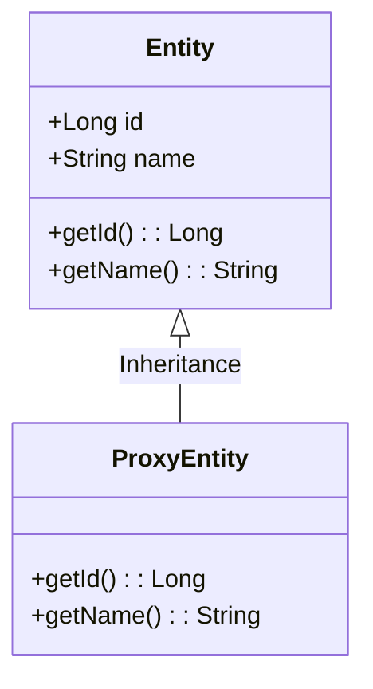
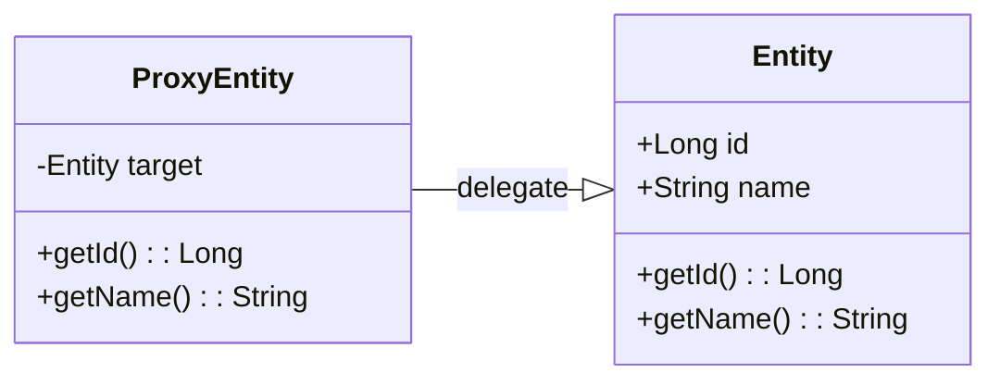

# 8장 프록시와 연관관계 관리 
## 8.1 프록시 
- 엔티티를 조회할 때 연관된 엔티티들이 항상 사용되는 것은 아니다. 
```java
@Entity 
public class Member{
    private String userName; 

    @ManyToOne
    Private Team team; 

    public Team getTeam(){
        return team;
    }
    public String getUserName(){
        return userName; 
    }
}

 
@Entity
public class Team{
    private String teamName; 

    public String getName(){
        return teamName;
    }
}
// 회원 + 팀 정보 

public void printUserAndTeam(String memberId){
    Member member = em.find(Member.class, memberId); 
    Team team = member.getTeam(); 
    System.out.println(member.getUserName());
    System.out.println(team.getName());
}

// 회원 정보 

public void printUser(String memberId){
    Member member = em.find(Member.class, memberId); 
    System.out.println(member.getUserName());
}

```
- JPA는 엔티티가 실제로 사용될 때 까지 데이터베이스를 지연하는 방법을 제공하는데 이것을 지연로딩이라고 한다. 
- 엔티티의 값을 실제 사용하는 시점에 데이터베이스에서 엔티티에 대한 필요한 데이터를 조죄하는 것이다. 
- 지연 로딩 기능을 사용하려면 실제 엔티티 객체 대신에 데이터베이스 조회를 지연할 수 있는 가짜 객체가 필요한데 이것을 **프록시 객체**라고 한다. 

### 8.1.1 프록시 기초 
- JPA에서 식별자 엔티티 하나를 조회할 때는 EntityManager.find()를 사용한다. 
- 이 메소드는 영속성 컨텍스트에 엔티티가 없으면 데이터베이스를 조회한다. 
- 엔티티를 직접 조회하면 실제 사용하든 하지 않든 데이터베이스를 조회하게 된다. 엔티티를 실제 사용하는 시점까지 미루고 싶으면 EntityManager.getReference()메소드를 사용하면 된다. 
- 이 메소드를 호출할 때 JPA는 데이터베이스를 조회하지 않고 실제 엔티티 객체를 생성하지도 않는 대신에 데이터베이스 접근을 위임한 프록시 객체를 반환한다. 

#### 프록시의 특징 
- 프록시 클래스는 실제 클래스를 상속 받아서 만들어지므로 실제 클래스와 겉모양이 같다. 
- 사용하는 입장에서 이것이 진짜 객체인지 프록시 객체인지 구분하지 않고 사용하면 된다.  



- 프록시 객체는 실제 객체에 대한 참조(target)를 보관한다. 
- 프록시 객체의 메소드를 호출하면 프록시 객체는 실제 객체의 메소드를 호출한다. 

#### 프록시 객체의 초기화 
- 프록시 객체는 member.getUserName()처럼 실제 사용될 때 데이터베이스를 조회해서 실제 엔티티의 객체를 생성하는데 이것을 프록시 객체의 초기화라고 한다. 

#### 프록시의 초기화 과정 
- 프록시 객체에 member.getUserName()을 호출해서 실제 데이터를 조회한다. 
- 프록시 객체는 실제 엔티티가 생성되어 있지 않으면 영속성 컨텍스트에 실제 엔티티 생성을 요청하는데 이것을 프록시 초기화라고 한다. 
- 영속성 컨텍스트는 데이터베이스를 조회해서 실제 엔티티 객체를 생성한다. 
- 프록시 객체는 생선된 실제 엔티티 객체의 참조를 target 멤버 변수에 보관한다. 
- 프록시 객체는 실제 엔티티의 getUserName()를 호출해서 결과를 반환한다. 

#### 프록시의 특징 
- 프록시 객체는 처음 사용할 때 한 번만 초기화된다. 
- 프록시 객체를 초기화한다고 프록시 객체가 실제 엔티티로 바뀌는 것은 아니다. 프록시 객체가 초기화돠면 프록시 객체를 통해서 실제 엔티티에 접근할 수 있다. 
- 프록시 객체는 원본 엔티티를 상속받은 객체이므로 타입 체크시 주의해서 사용해야 한다. 
- 영속성 컨텍스트에 찾는 엔티티가 있으면 데이터베이스를 조회할 필요가 없으므로 em.getReference()를 호출해도 프록시가 아닌 실제 엔티티를 반환한다. 
- 초기화는 영속성 컨텍스트의 도움을 받아야 가능하기 때문에 영속성 컨텍스트의 도움을 받을 수 없는 준영속 상태의 프록시 초기화를 사용하면 문제가 발생한다. 

#### 준영속 상태의 초기화
```java
Member member = em.getReference(Member.class, "id1"); 
transaction.commit();
em.close();
//member.getUserName(); LazyInitalizationException 에러 발생 

```
### 8.1.2 프록시와 식별자 
- 엔티티를 프록시로 조회할 때 식별자 값을 파라미터로 전달하는데 프록시 객체는 이 식별자 값을 보관한다. 
```java
Team team = em.getReference(Team.class, "team1");
team.getId() // 초기화되지 않음 
```
- 프록시 객체는 식별자 값을 가지고 있으므로 식별자 값을 조회하는 team.getId()를 호출해도 프록시를 초기화 하지 않는다. 
- 엔티티 접근 방식을 @Access(AccessType.PROPERTY)로 설정한 경우에만 초기화하지 않는다. 
```java
Member member = em.find(Member.class, "member1");
Team team = em.getReference(Team.class, "team1");
member.setTeam(team);
``` 
- 연관관계를 설정할 때 식별자 값만 사용하므로 프록시를 사용하면 데이터베이스 접근횟수를 줄일 수 있다. 


### 8.1.3 프록시 확인 
- JPA가 제공하는 PersistenceUnitUtil.isLoaded(Object Entity) 메소드를 사용하면 프록시 인스턴스의 초기화 여부를 확인할 수 있다. 

```java 

boolean isLoad = em.getEntityFactory()
                .getPersistenceUnitUtil().isLoaded(entity); 


```