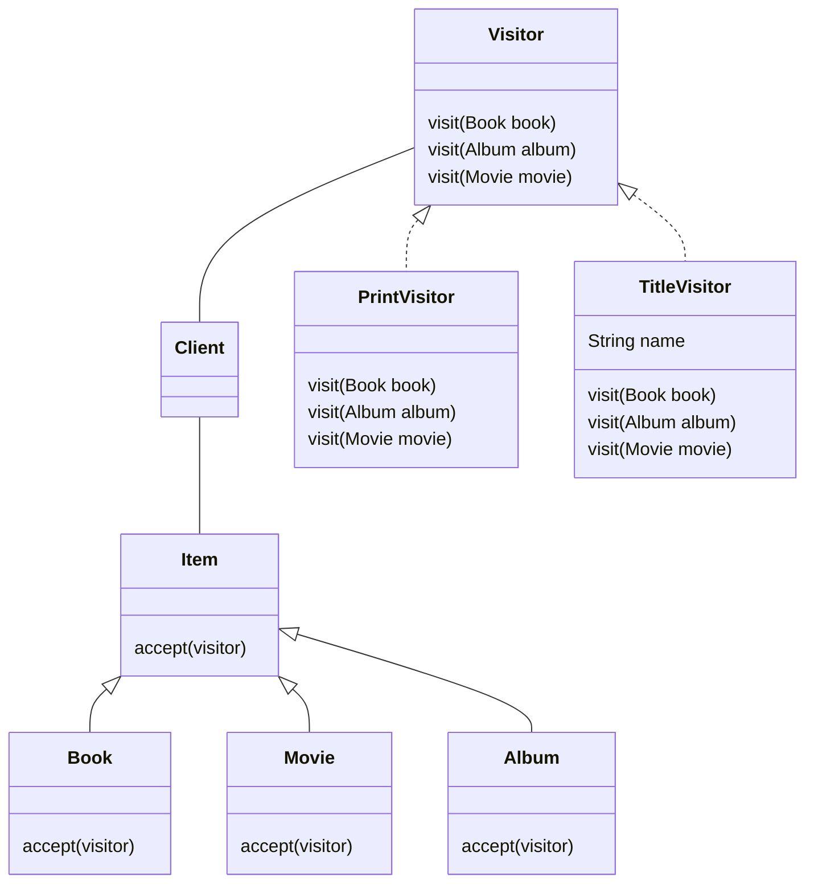

# 15장 고급주제와 성능 최적화

## 15.3 프록시 심화 주제  
- 프록시는 원본 엔티티를 상속 받아서 만들어지므로 엔티티를 사용하는 클라이언트는 엔티티가 프록시 인지 아니면 원본 엔티티인지 구분하지 않고 사용할 수 있다. 

### 15.3.1 영속성 컨텍스트와 프록시 
- 영속성 컨텍스트는 자신이 관리하는 영속 엔티티의 동일성을 보장한다. 
```java
@Test 
public void persistence_context_proxy() {
    Member newMember = new Member("member1", Member.class)
    em.persist(newMember);
    em.flush();
    em.clear();

    Member refMember = em.getReference(Member.class, "member1");

    Member findMember = em.find(Member.class, "member1"); 

}

```
- refMember은 프록시이고 findMember은 원본 엔티티이지만 영속성 컨텍스트는 프록시로 조회된 엔티티에 대해서 같은 엔티티를 찾는 요청이 들어오면 원본 엔티티가 아닌 처음 조회된 엔티티를 반환한다. 
- 프록시로 조회해도 영속성 컨텍스트는 영속 엔티티의 동일성을 보장한다. 


### 15.3.2 프록시 타입 비교 
- 프록시는 원본 엔티티를 상속 받아서 만들어지므로 프록시로 조회한 엔티티의 타입을 비교할 경우에는 == 비교를 하면 안 되고 대신에 instanceof를 사용해야 한다. 

### 15.3.3 프록시 동등성 비교 
- 엔티티의 동등성을 비교하기 위해서는 비즈니스 키를 사용해서 equals() 메소드를 오버라이딩하고 사용하면 된다. 
- 프록시는 원본을 상속받은 자식 타입이므로 프록시 타입을 비교할 때는 == 비교가 아닌 instanceof를 사용해야 한다. 
- equals() 메소드를 구현할 때는 일반적으로 멤버변수를 직접 비교하는데 프록시의 경우 문제가 된다. 프록시는 실제 데이터를 가지고 있지 않기 때문에 아무 값도 조회할 수 없다. 
- 프록시로 데이터를 조회할 때는 접근자를 사용해야 한다. 

### 15.3.4 상속관계와 프록시 
- 프록시를 부모타입으로 조회하면 부모의 타입을 기반으로 프록시가 생성되는 문제가 있다. 
- instanceof 연산을 사용할 수 없다. 
- 하위타입으로 다운캐스팅 할 수 없다. 

#### JPQL로 대상 직접 조회 
- 처음부터 자식 타입을 직접 조회해서 필요한 연산을 진행한다. 

#### 프록시 벗기기 
- 하이터네이트가 제공하는 기능을 사용하면 프록시에서 원본 엔티티를 가져올 수 있다. 
- 영속성 컨텍스트는 한 번 프록시로 노출할 엔티티는 계속 프록시로 노출한다. 
- 프록시에서 원본 엔티티를 직접 꺼내면 프록시와 원본 엔티티의 동일성 비교가 실패한다. 
- 이 방법을 사용할 때는 원본 엔티티가 꼭 필요한 곳에 잠깐 사용하고 다른 곳에 사용되지 않도록 사용하는 것이 중요하다. 

#### 기능을 위한 별도의 인터페이스 제공 
- 인터페이스를 제공하고 각각의 클래스가 자신에 맞는 기능을 구현하는 것이 다형성을 활용한 방법이다.  


#### 비지터 패턴 사용 



- 비지터 패턴은 새로운 기능이 필요할 때 Visitor만 추가 해주면 된다. 

#### 비지터 패턴 정리 
- 프록시에 대한 걱정없이 안전하게 원본 데이터에 접근이 가능하다. 
- instanceof과 타입 캐스팅 없이 코드 구현이 가능하다. 
- 알고리즘과 객체 구조를 분리해서 구조를 수정하지 않고 새로운 동작을 추가 가능하다. 

